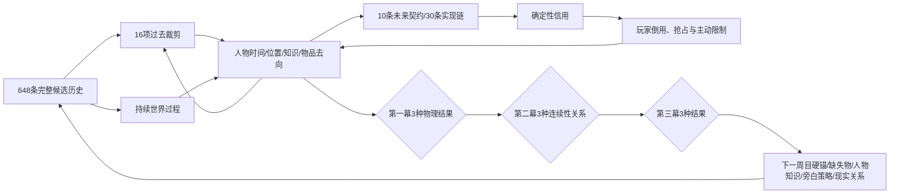

# 《返潮》世界线、过去与预言关系图

```mermaid
flowchart LR
  T0[648条完整候选历史] --> H[16项过去裁剪]
  T0 --> W[持续世界过程]
  H --> K[人物时间/位置/知识/物品去向]
  W --> K
  P[10条未来契约/30条实现链] --> C[确定性信用]
  C --> A[玩家倒用、抢占与主动限制]
  A --> K
  K --> H
  K --> P
  K --> R1{第一幕3种物理结果}
  R1 --> R2{第二幕3种连续性关系}
  R2 --> R3{第三幕3种结果}
  R3 --> N[下一周目硬锚/缺失物/人物知识/旁白策略/现实关系]
  N --> T0
```

完整逐项关系由公开页面 `guide.html` 根据游戏内容表生成，避免文档与代码漂移。
